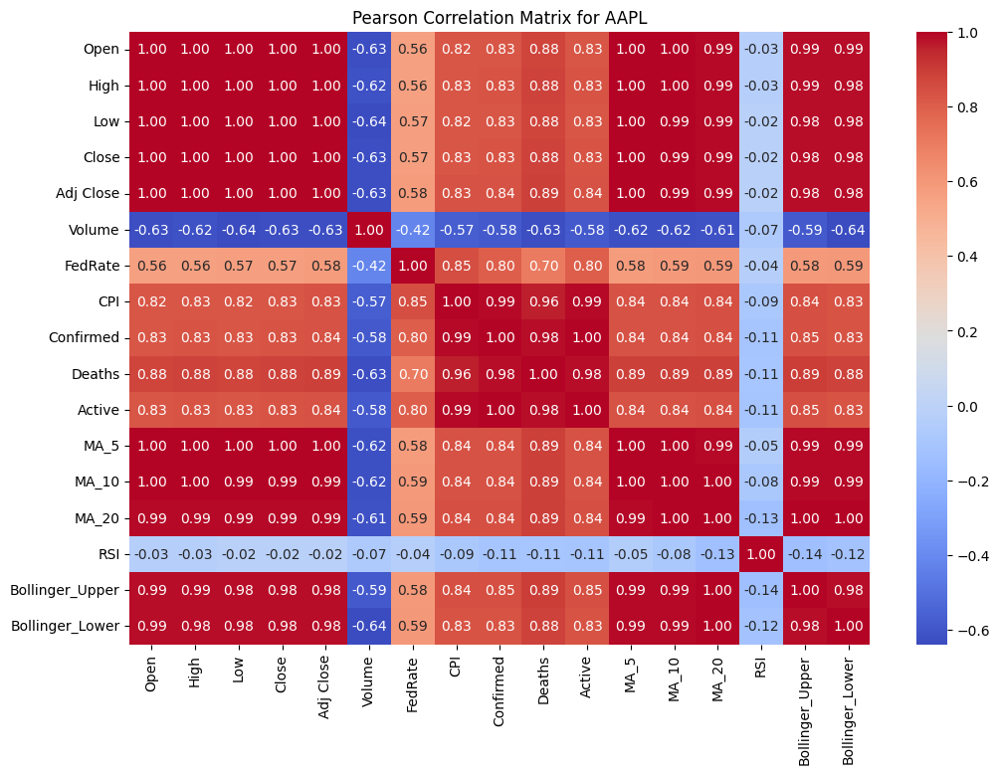
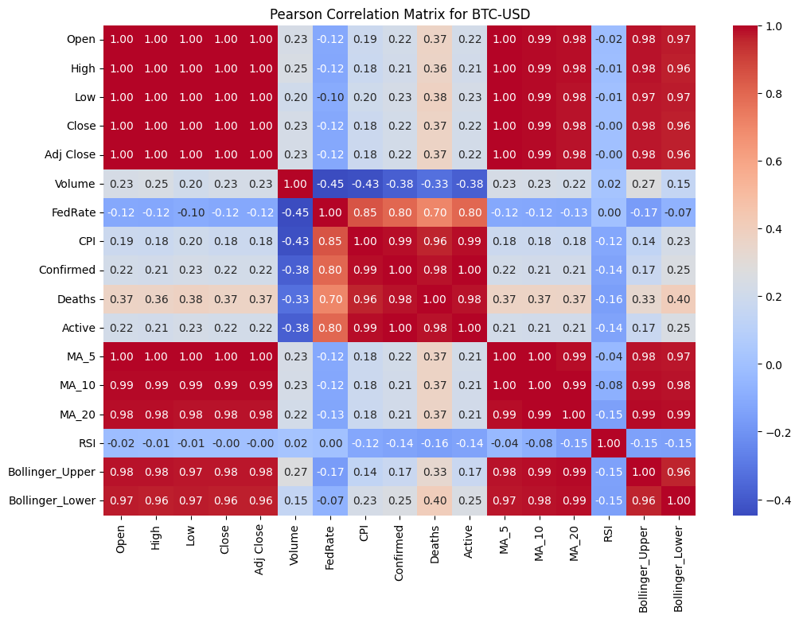

## 1  爬取数据

目前爬取了我们需要的各类需要经济指标的数据和可能影响经济发展的疫情数据，美国通货膨胀率和消费者物价指数以及股票、期货和虚拟货币数据，详细的下载代码位于 `data_spider.ipynb` 文件。

#### 1.1 数据来源

###### 股票、期货以及虚拟货币的数据来源
数据来源于雅虎财经，可通过 python 的 `yfinance` 第三方库下载财经数据。需要首先安装 `yfinance`。 代码如下：
```shell
 pip install yfinance
```

###### 疫情数据来源
疫情数据由约翰斯·霍普金斯大学系统科学与工程中心（CSSE，Center for Systems Science and Engineering）提供。这些数据是约翰斯·霍普金斯大学冠状病毒资源中心（Johns Hopkins Coronavirus Resource Center）的一部分，旨在跟踪和分析全球COVID-19疫情的传播情况​ (GitHub)​​ (GitHub)​​ (GitHub)​。可在 github 上下载。

确诊人员数据下载链接

https://raw.githubusercontent.com/CSSEGISandData/COVID-19/master/csse_covid_19_data/csse_covid_19_time_series/time_series_covid19_confirmed_US.csv


死亡人员数据下载链接

https://raw.githubusercontent.com/CSSEGISandData/COVID-19/master/csse_covid_19_data/csse_covid_19_time_series/time_series_covid19_deaths_US.csv

###### 经济指标数据
美联储利率数据（Fed Rate）和美国消费者物价指数（CPI）数据来源于美国联邦储备银行经济数据（FRED，Federal Reserve Economic Data）数据库。这个数据库由圣路易斯联邦储备银行提供，涵盖了大量的经济和金融数据。可通过 `pandas_datareader.data` 库下载。

#### 1.2 各类股票、期货、虚拟货币代码含义

* NG=F: 天然气期货
* CL=F: 原油期货 
* HG=F: 铜期货
* PL=F: 铂金期货
* SI=F: 白银期货
* GC=F: 黄金期货
* ^GSPC: 标准普尔500指数
* ^NDX: 纳斯达克100指数
* AAPL: 苹果公司
* TSLA: 特斯拉公司
* MSFT: 微软公司
* GOOGL: 谷歌公司
* NVDA: 英伟达公司
* BRK-B: 伯克希尔哈撒韦公司 B类股票
* NFLX: 奈飞公司
* AMZN: 亚马逊公司
* META: Meta（原Facebook）公司
* BTC-USD: 比特币（Bitcoin）
* ETH-USD: 以太坊（Ethereum）
* BNB-USD: 币安币（Binance Coin）
* ADA-USD: 艾达币（Cardano）
* XRP-USD: 瑞波币（XRP）
* SOL-USD: Solana 货币

## 2  数据清洗

因为研究时间段范围要比疫情范围广，目前获得的疫情数据为 2020-1-22 到 2023-3-9（来源于 github），且股票在周末不开盘，因此需要在时间上对齐。
我的数据清洗策略是 不开盘的日期股价和前一天的股价一致， 疫情时间范围之前认为和疫情第一天一致，时间范围之后的数据认为和最后一天一致

清洗后的数据包括以下属性

* Date: 日期。表示该行数据对应的具体日期。

* Open: 开盘价。当天股票的第一笔交易的价格。

* High: 最高价。当天股票交易中的最高价格。

* Low: 最低价。当天股票交易中的最低价格。

* Close: 收盘价。当天股票交易的最后一个价格。

* Adj Close: 调整后的收盘价。调整了分红和拆股影响后的收盘价格，更准确地反映股票的实际价值。

* Volume: 成交量。当天股票交易的总数量。

* FedRate: 美联储利率。通常指联邦基金利率，这是美国银行间隔夜借贷的利率。

* CPI: 消费者价格指数（Consumer Price Index）。衡量消费者购买的一篮子商品和服务的价格变化，反映通货膨胀。

* Confirmed: 新冠确诊人数。当天报告的新冠病毒确诊病例总数。

* Deaths: 新冠死亡人数。当天报告的新冠病毒死亡病例总数。

* Active: 新冠活跃病例数。当前仍在治疗或隔离中的新冠病毒活跃病例总数。

* Ticker: 股票/期货/虚拟货币的代码。表示它们在市场的唯一标识符，具体可见上方的各类代码含义。


## 3.特征选取

分析清洗过的数据，这里通过进行相关性分析，根据各指标的相关性来选取需要的经济特征进行股票预测，一般的策略是多个特征的相关性较强时，仅选取其中一个特征进行股票预测，目的是防止数据过拟合，多个特征的相关性较差时，可全部参与预测。相关性分析详细代码见 `stock_corre.ipynb` 文件。。

#### 3.1 相关性矩阵图

在绘制相关性矩阵时，根据搜索到的资料，股市除了受到经济指标影响外，还可能受到技术指标的影响。因此，通过股价数据计算了额外的6个经济指标，这些指标也被参与相关性的分析。6个技术指标分别如下：

* MA_5, MA_10, MA_20：分别表示5日、10日和20日移动平均线。
* RSI：相对强弱指数，用于识别股票的超买或超卖状态。
* Bollinger_Upper, Bollinger_Lower：布林带的上轨和下轨，用于衡量市场的波动性和价格的相对高低。


* 股票相关性矩阵





* 期货相关性矩阵


* 虚拟货币相关性矩阵



#### 3.2 相关性分析

由于 `Adj Close` 是我们预测的目标，因此需要考虑其他特征与其的相关性。从图上可以得出以下结论

1. 'Open', 'High', 'Low', 'Close' 和  `Adj Close` 存在强相关性。
2. 技术指标 'MA_5', 'MA_10', 'MA_20', 'Bollinger_Upper', 'Bollinger_Lower' 之间存在相关性，且它们均和 `Adj Close` 有强相关性
3. 经济指标 'CPI' 和疫情数据 'Confirmed', 'Deaths', 'Active' 之间存在相关性，但它们与各股票价格  `Adj Close` 之间的相关性表现不一致。
4. 在 3 的基础上，暂时认为新冠影响 CPI，CPI 影响股价（取决于具体的股票，比如 AAPL 的股价与 CPI 的相关性超过 80%，超过了边界条件）。
5. 综上选取如下特征对股价的影响

* 'Adj Close' 调整收盘价
* 'Volume' 成交量
* 'FedRate'  美联储利率
* 'CPI' 消费者价格指数
* 'RSI' 相对强弱指数，用于识别股票的超买或超卖状态


## 4. 数据拟合

#### 4.1 股票价格的拟合

对苹果、特斯拉、亚马逊和标普500指数进行拟合。原始数据80% 作为训练集， 20%作为测试集。时间序列长度为 10

###### LSTM
使用 torch 框架完成神经网络的搭建，使用 Min-Max 归一化方法将所有特征缩放到 [0, 1] 范围内。归一化公式如下：


1. 模型构建
定义了一个多层 LSTM 神经网络模型，用于时间序列预测。不同的股价模型的具体参数不一致，具体来说主要是学习率和训练轮数的不同。

公共参数
 - 输入层：特征的数量，即归一化后的特征数量。
 - 隐藏层：50 个隐藏单元。
 - LSTM 层数：3 层。
 - Dropout 概率：0.1。

苹果 学习率：0.0003，训练轮数为 2000

亚马逊 学习率：0.001，训练轮数为 500

特斯拉 学习率：0.008，训练轮数为 500

标普500指数 学习率：0.011，训练轮数为 1000

2. 模型训练

- 对每个批次的数据进行前向传播，计算预测值和损失。
- 使用反向传播算法更新模型参数。
- 在每个 epoch 结束后，计算训练集和测试集的 RMSE（均方根误差）,用以判断训练过程是否正常，正常情况下，两者误差均会收敛，理想情况下， 测试集的 误差应该和训练集的误差相近。
- 在每个 epoch 结束后，如果测试集的 RMSE 优于当前最佳 RMSE，则保存模型参数。

3. 预测结果


4. 结果评估
训练结束后，绘制训练集和测试集的损失函数变化图，分析模型的收敛情况和预测性能。

* 苹果


- 特斯拉


* 标普 500


- 亚马逊


可以看到模型的误差均在下降，且都在逐渐收敛，但是整体而言测试集误差均高于训练集误差，标普 500 和 特斯拉股票模型存在一定程度的波动现象，说明其股票模型可能存在过拟合现象，而亚马逊的模型测试和训练集均收敛，说明拟合效果较好，苹果股票的模型测试和训练集亦均收敛，但是预测结果较差，测试集的误差在收敛后始终无法接近训练集的误差值。

###### ARIMA

1. 数据平稳性检验
首先使用 ADF（Augmented Dickey-Fuller）对股票数据进行平稳性检验。结果是数据平稳性较差，因此需要进行差分。三个股票数据均在一次差分后，数据趋于稳定。

2. 参数确定
在数据平稳后 ACF 图和 PACF 图分别如下
* 标普500


- 亚马逊


* 特斯拉


- 苹果


### PACF 和 ACF 确定 ARIMA 模型参数的方法

| 模型类型         | ACF 特征 | PACF 特征 | 备注               |
|------------------|----------|-----------|--------------------|
| AR (p) 模型      | 拖尾     | 截尾      | ACF 不显著截断    |
| MA (q) 模型      | 截尾     | 拖尾      | PACF 不显著截断   |
| ARMA (p, q) 模型 | 拖尾     | 拖尾      | ACF 和 PACF 均不显著截断 |
| ARIMA (p, d, q) 模型 | 拖尾（d次差分后） | 拖尾（d次差分后） | ACF 和 PACF 均不显著截断 |
| IMA (d, q) 模型  | 截尾     | 拖尾      | 数据需要经过差分使其平稳 |
| ARI (p, d) 模型  | 拖尾     | 截尾      | 数据需要经过差分使其平稳 |


根据此表可以看出，数据特征不适用 ARIMA 方法，但我还是使用此法进行了股价的预测，均为数据点的最后一个值，如下图：

根据数据特征得出参数 p q b 均为 1.


#### 4.2 期货价格的拟合

对原油（CL=F）、黄金期货（GC=F）价格进行拟合。原始数据80% 作为训练集， 20%作为测试集。时间序列长度为 10

###### LSTM

具体模型以及参数的方法和股票预测方式一致，公共参数为：

原油 学习率：0.007，训练轮数为 1000

黄金 学习率：0.007，训练轮数为 1500


3. 预测结果


4. 结果评估
训练结束后，绘制训练集和测试集的损失函数变化图，分析模型的收敛情况和预测性能。

- 原油


* 黄金


可以看到预测的股价和真实股价趋势较为一致，且在在实际价格上下波动，说明预测效果较好。但测试集和真实集误差图的效果较差，且波动振幅巨大，说明模型可能存在过拟合现象

###### ARIMA

和股票现象一致，结果如下图


#### 4.3 虚拟货币价格的拟合

对比特币(BTC-USD)、币安币(BNB_USD)和以太币(ETH_USD)价格进行拟合。原始数据80% 作为训练集， 20%作为测试集。时间序列长度为 10

###### LSTM
具体模型以及参数的方法和股票预测方式一致，公共参数为：

比特币 学习率：0.005，训练轮数为 1000

币安币 学习率：0.001，训练轮数为 1000

以太币 学习率：0.001，训练轮数为 1500

3. 预测结果


4. 结果评估
训练结束后，绘制训练集和测试集的损失函数变化图，分析模型的收敛情况和预测性能。

- 比特币

* 币安币

- 以太币


可以看到预测的股价和真实股价变化趋势较为一致，且在在实际价格上下波动，说明预测效果较为准确。从测试集和真实集误差图来看，比特币波动振幅巨大，说明模型可能存在过拟合现象，其他两个货币误差均收敛且趋于稳定，说明拟合效果较好

###### ARIMA

和股票现象一致，结果如下图


## 5. 结论

1. 针对我们研究的数据而言，LSTM 预测股价相对 ARIMA 而言相对更加准确，无论是趋势还是误差。

2. 大部分股票价格受到 CPI 的影响（相关性阈值低于 0.8），少部分受影响（如 AAPL）

3. 通过相关性矩阵来看，疫情和 CPI 相关性很强，说明疫情直接影响 CPI

4. 股票价格受 CPI 影响的拟合效果较好，不受 CPI 价格影响的（如：苹果，代码为AAPL）拟合效果极差，即使模型收敛。